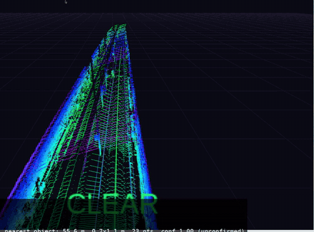
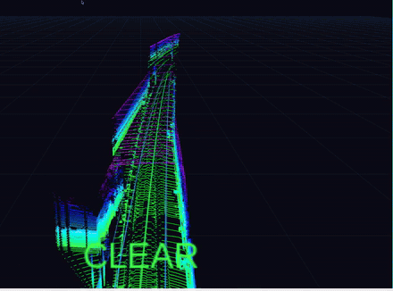
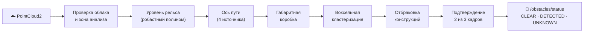

<div align="center">

# 🚇 I.MOSCOW

### Обнаружение посторонних объектов перед беспилотным поездом в тоннеле метро по данным 3D-лидара


Геометрический детектор без нейросетей и обучения: строит модель *нормального* тоннеля
и сообщает обо всём, что оказалось в габарите поезда и не похоже на тоннель.

</div>

<table>
  <tr>
    <th>Препятствие на пути: <code>OBSTACLE 56 m</code></th>
    <th>Пустой тоннель с поворотом: <code>CLEAR</code></th>
  </tr>
  <tr>
    <td></td>
    <td></td>
  </tr>
  <tr>
    <td align="center"><a href="solution/video/demo_obstacle_doubleT.mp4">▶ полное видео (28 с)</a></td>
    <td align="center"><a href="solution/video/demo_clear_roundT_doubleT.mp4">▶ полное видео (32 с)</a></td>
  </tr>
</table>

## ✨ Коротко

|  |  |
|---|---|
| **Вход** | поток `sensor_msgs/PointCloud2` с лидара на голове поезда: rosbag2 (SQLite3 / MCAP) или живой топик; имя топика определяется автоматически |
| **Выход** | `/obstacles/status`: `CLEAR` / `DETECTED` / `UNKNOWN`, расстояние до ближайшего препятствия, положение, размеры и уверенность по каждому объекту; маркеры для RViz |
| **Метод** | модель рельса и оси пути → габаритная коробка → воксельная кластеризация → отбраковка конструкций тоннеля → подтверждение во времени |
| **Качество** | препятствие найдено во **всех 47 из 47** кадров, расстояние 55,7–56,3 м (эталон 55,4–56,7 м); **1 ложный кадр** на 2488 кадров (precision 0,979, recall 1,0) |
| **Скорость** | 24 мс на облако 307 тыс. точек, 48 мс на 921 тыс.; узел держит ≈ 29 / 19 кадров/с при потоке 10 Гц |
| **Ресурсы** | только CPU, 120–230 МБ ОЗУ; NumPy + SciPy в одном Python-узле ROS 2 |

## 🧠 Как это работает



1. **Уровень рельса**: робастная подгонка полинома по медианам полотна, линейная экстраполяция туда, где полотна не видно.
2. **Ось пути**: четыре источника — симметрия профиля полотна, центр лотка, центры свободного пространства между стенами и потолком, цепочка сдвигов профиля от бина к бину. Так коридор следует за поворотами.
3. **Габарит**: полуширина 1,0 м внизу и 1,4 м по кузову, от 0,3 до 3,4 м над рельсом; запасы растут с дальностью и кривизной.
4. **Кластеры и отбраковка**: воксельная кластеризация, затем правила, которые отсеивают стены, колонны, края платформ, участки пола и другие вытянутые или привязанные к тоннелю конструкции.
5. **Время**: объект подтверждается в 2 из 3 кадров (3 из 4 дальше 100 м). Расстояние — евклидово от лидара до ближайшей достоверной поверхности объекта.

Подробно: [алгоритм](solution/docs/algorithm.md) · [архитектура](solution/docs/architecture.md) · [эксперименты](solution/docs/experiments.md) · [заметки по данным](solution/docs/data_notes.md)

## 📊 Результаты

Каждый кадр всех шести записей (2488 облаков, 250 с), офлайн-прогон в контейнере:

| запись | кадров | верно найдено | ложных | пропусков | время обработки, мс (медиана / p95) |
|---|---:|---:|---:|---:|---|
| `doubleT_obstacle` (921 тыс. точек) | 201 | **47** | 0 | 0 | 61 / 82 |
| `doubleT_platform` | 345 | – | 1 | – | 38 / 48 |
| `roundT_doubleT` | 252 | – | 0 | – | 43 / 60 |
| `roundT_pressureGate_roundT` | 268 | – | 0 | – | 40 / 61 |
| `roundT_squareT_pressureGate_squareT` | 545 | – | 0 | – | 33 / 62 |
| `squareT_platform_squareT_switch` | 877 | – | 0 | – | 29 / 65 |
| **всего** | **2488** | **47** | **1** | **0** | |

Время в таблице замерено при трёх параллельных контейнерах. Препятствие подтверждается через 0,4 с после того, как объект входит в габарит. Единственное ложное срабатывание — обломок края платформы на 58 м при въезде на станцию, длится 1 кадр (0,1 с).

> [!NOTE]
> Это результаты на данных разработки: пороги подбирались на тех же шести записях, а пример препятствия всего один (на 56 м, поезд стоит). Независимая оценка возможна только на контрольной записи организаторов. Подробности и абляции — в [experiments.md](solution/docs/experiments.md).

## 🚀 Быстрый старт

Нужен только Docker (и X11-сессия, если хотите RViz).

**1. Получить образ** — готовый из `dist/` (без сети) или собрать:

```bash
git clone https://github.com/garabot11/I.MOSCOW.git
cd I.MOSCOW/dist
cat metro-lidar-final.tar.gz.part-* > metro-lidar-final.tar.gz
sha256sum -c metro-lidar-final.tar.gz.sha256
docker load -i metro-lidar-final.tar.gz             # → metro-lidar:final
```

<details>
<summary>…или собрать из исходников (≈ 2,5 мин)</summary>

```bash
cd I.MOSCOW/solution
docker build --target solution \
  --build-arg APP_UID="$(id -u)" --build-arg APP_GID="$(id -g)" \
  -t metro-lidar:final .
docker run --rm metro-lidar:final python3 -m pytest -q /workspace/tests   # 38 тестов
```

</details>

**2. Прогнать запись офлайн** (каждый кадр, результат в JSONL + сводка):

```bash
mkdir -p results
docker run --rm -v /path/to/bags:/data:ro -v "$PWD/results":/results metro-lidar:final \
  ros2 run metro_obstacle_detector offline --bag /data/doubleT_obstacle --out /results/doubleT_obstacle.jsonl
```

**3. Живой режим:** узел + `ros2 bag play`:

```bash
# терминал 1 — детектор
docker run --rm -it --name metro-lidar --network host --shm-size=1g \
  -e ROS_DOMAIN_ID=78 -e ROS_LOCALHOST_ONLY=1 \
  -v /path/to/bags:/data:ro -v "$PWD/results":/results metro-lidar:final \
  ros2 launch metro_obstacle_detector detector.launch.py log_path:=/results/live.jsonl

# терминал 2 — проигрывание записи
docker exec -it metro-lidar /workspace/entrypoint.sh \
  ros2 bag play /data/roundT_doubleT --rate 1.0 --delay 2 --wait-for-all-acked 5000

# терминал 3 — статус по каждому кадру
docker exec -it metro-lidar /workspace/entrypoint.sh ros2 run metro_obstacle_detector status_monitor
```

**4. С визуализацией в RViz2:**

```bash
cd solution
scripts/run_demo.sh /path/to/bags/doubleT_obstacle /sensing/lidar/hesai128/pointcloud 1.0 results/demo metro-lidar:final
```

Все варианты запуска, параметры, QoS, проигрывание вне контейнера и типовые проблемы — в [solution/README.md](solution/README.md) ([English](solution/README.en.md)).

## 📡 Выход

`metro_obstacle_msgs/ObstacleStatus` публикуется на каждое облако:

| поле | смысл |
|---|---|
| `status` | `0 UNKNOWN` · `1 CLEAR` · `2 DETECTED` |
| `distance_m` | расстояние от лидара до ближайшего подтверждённого препятствия, м |
| `obstacles[]` | все кандидаты кадра: смещение от оси пути, высота над рельсом, размеры, число точек, уверенность |
| `processing_ms` | время обработки облака |
| `diagnostics` | причина `UNKNOWN`: нет облаков, несколько топиков, поток прервался |

Дополнительно: `/obstacles/markers` (RViz) и `/obstacles/candidates` (точки принятых кандидатов).

## 📁 Структура репозитория

```
I.MOSCOW/
├── solution/                       решение
│   ├── src/metro_obstacle_detector/    узел ROS 2, офлайн-инструмент, алгоритм
│   ├── src/metro_obstacle_msgs/        сообщения ObstacleStatus, Obstacle
│   ├── config/                         detector.yaml, RViz, профиль Fast DDS
│   ├── scripts/                        демо, оценка, потоковый тест, запись видео
│   ├── tests/                          38 тестов (pytest)
│   ├── docs/                           алгоритм, архитектура, эксперименты, данные
│   ├── annotations/  manifests/        разметка событий, состав записей с SHA-256
│   ├── results/                        сырые результаты всех прогонов
│   ├── video/                          демо-видео
│   └── Dockerfile
├── audit/                          проверка соответствия заданию (2026-09-29)
└── dist/                           готовый образ metro-lidar:final (архив частями)
```

Записи лидара (rosbag2, 23 ГБ) в репозиторий не входят — это данные организаторов.

## ⚠️ Ограничения

- Габарит (полуширина вагона, короба контактного рельса, края платформ) выведен из данных, а не задан организаторами.
- Дальность ограничена тем, что видно в тоннеле: за поворотом коридор закрывается, низкие объекты видны там, где виден настил пути (≈ 60–120 м).
- `CLEAR` означает «в анализируемой области нет подтверждённого объекта», а не доказанную свободу пути. Обнаружение на 100–300 м на этих данных не проверено.
- Расстояние отсчитывается от лидара: смещение до лобовой части поезда неизвестно.

<div align="center">

**Кейс «Система обнаружения посторонних объектов для беспилотных поездов в тоннеле метро по данным 3D-лидара»**

</div>
